⌚​🤖​✔️​FORMULARIO CONTROLES COMPLETOS - FLUTTER ⌚​🤖​✔️​:
==============================================

crear un script nuevo **RegistroPage.dart**

1. agregar la siguiente codificación:

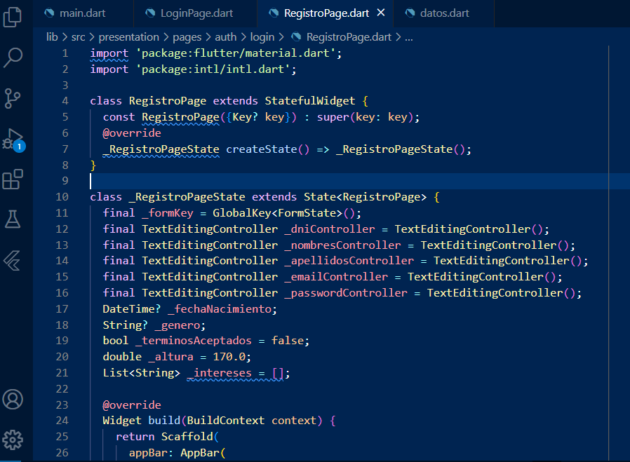

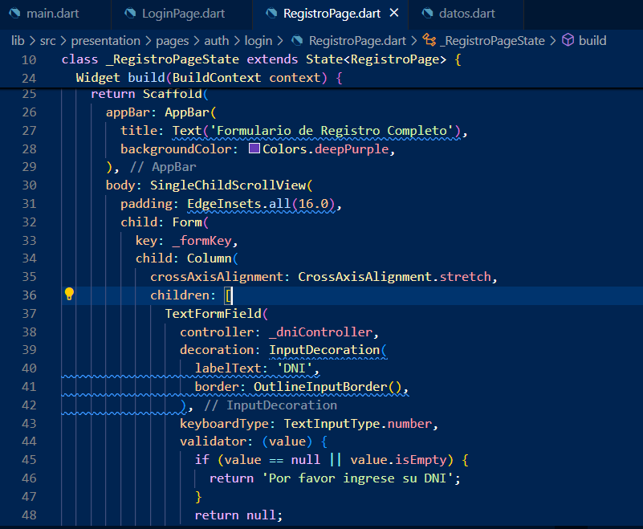

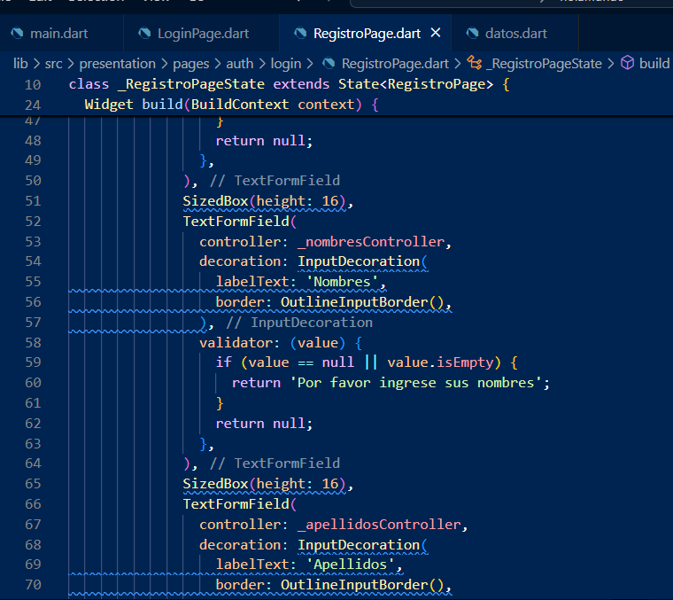

.. image:: img/cap4.png
   :height: 40
   :width: 90
   :scale: 10
   :alt: JoeAI

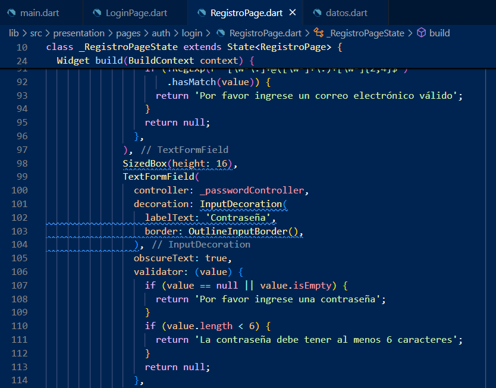

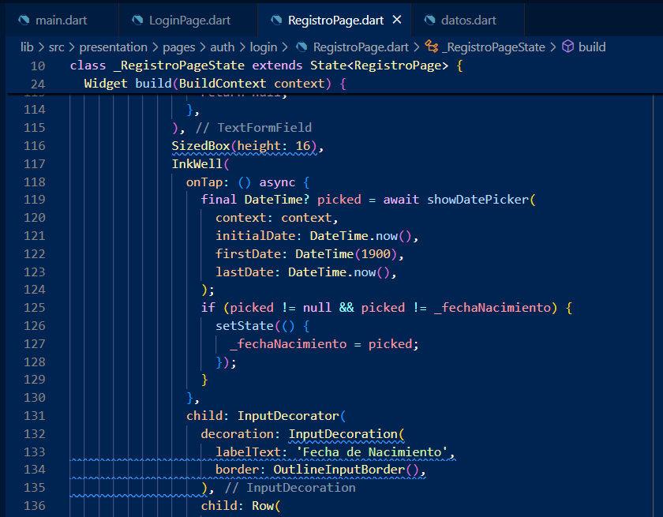

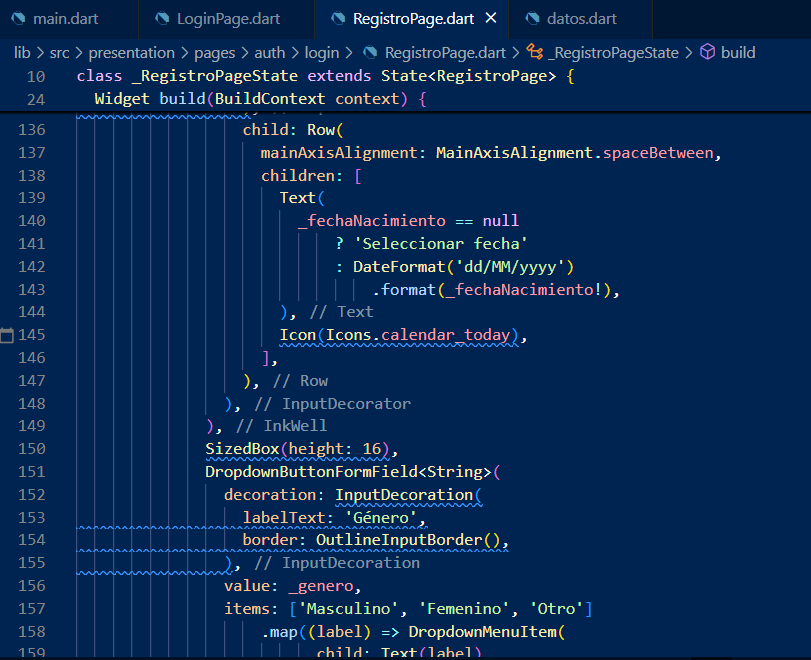

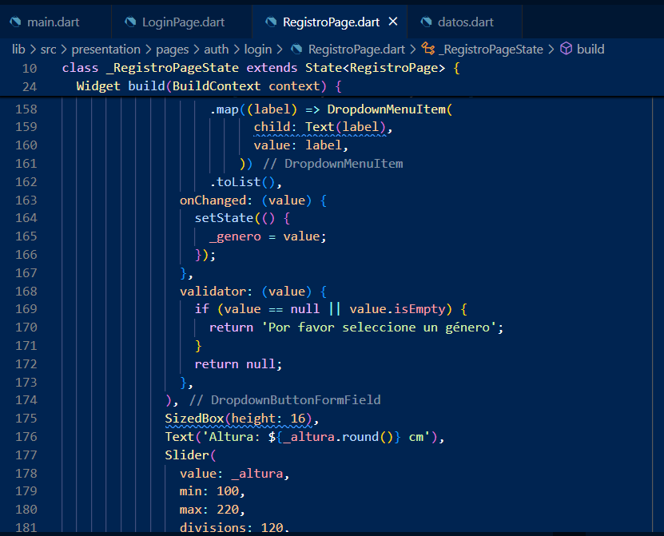

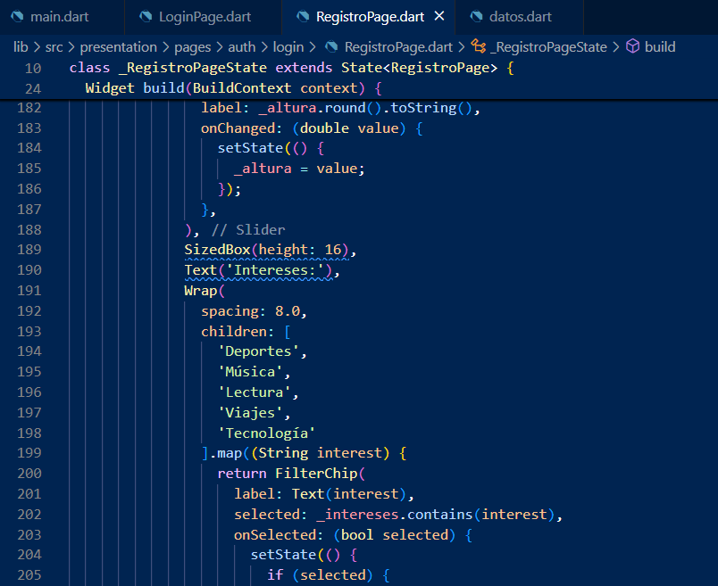

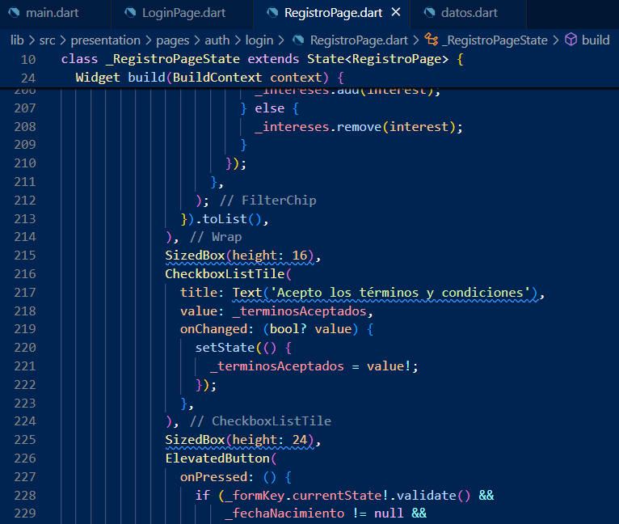

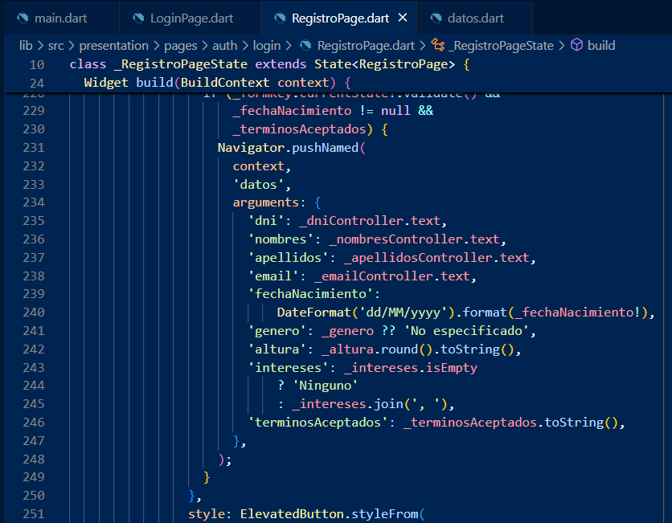

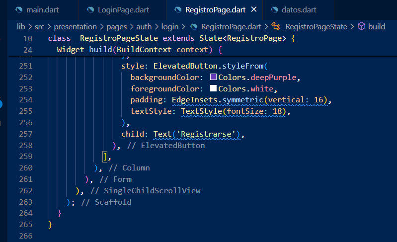

luego en el archivo **datos.dart**

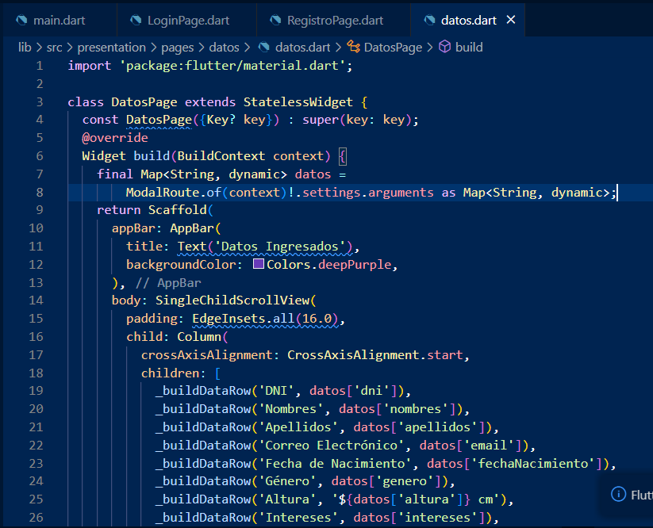

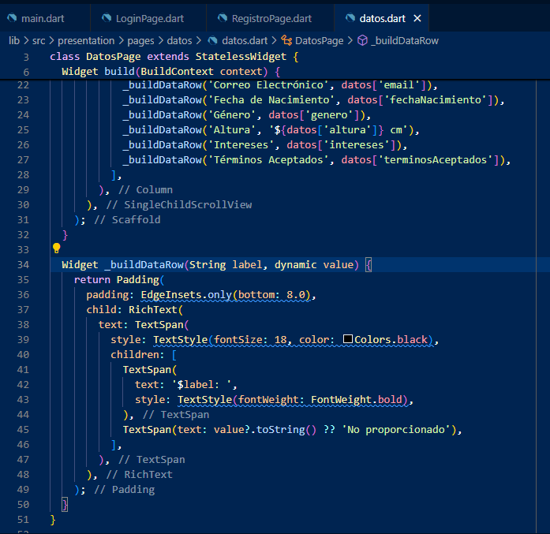
