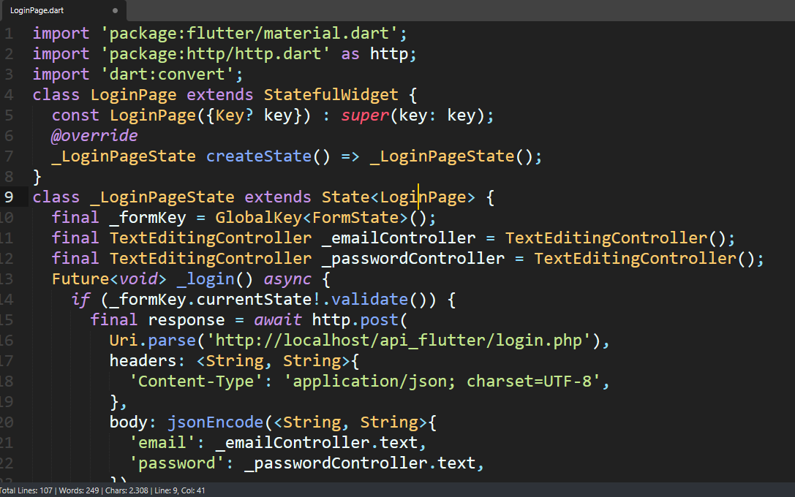
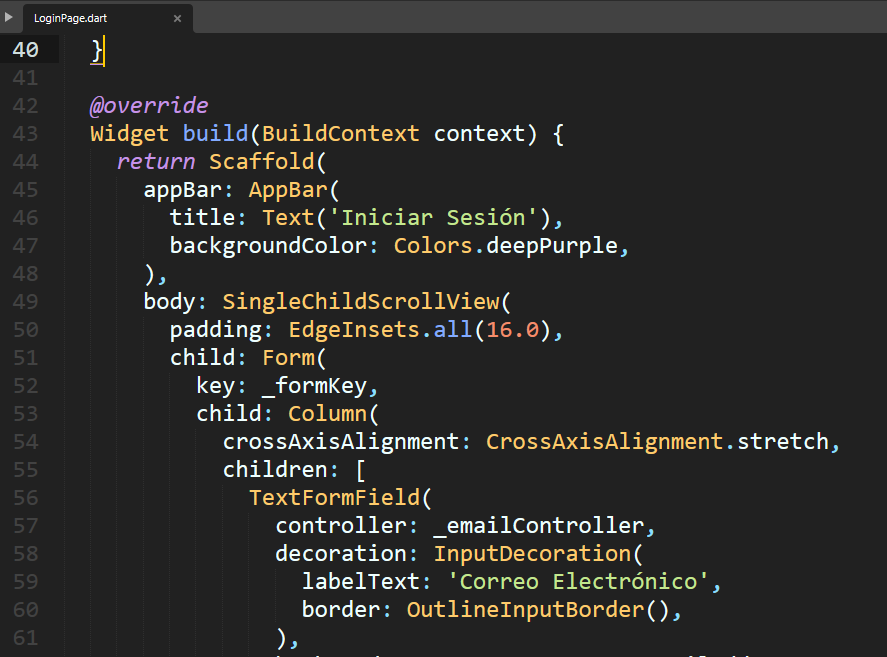
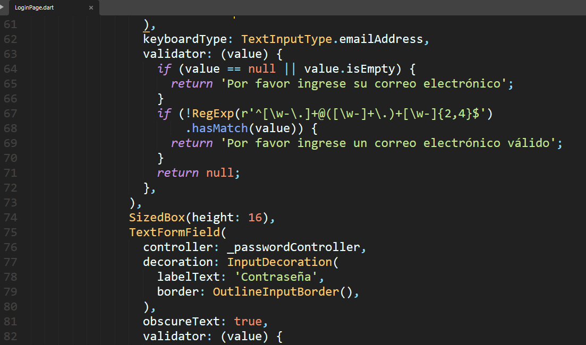
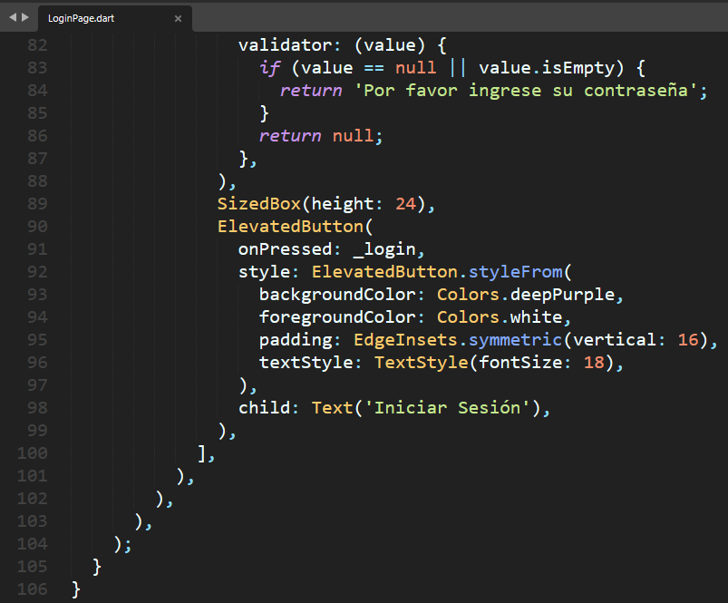

LOGIN FLUTTER

**1. En el proyecto API que tenemos en la ruta C://Xampp/htdocs/api_flutter, deberá crear el fichero de nombre "login.php"**
Escribir el comando: 

Linea::

  <?php
  header('Access-Control-Allow-Origin: *');
  header('Content-Type: application/json; charset=UTF-8');
  header('Access-Control-Allow-Methods: POST');
  header('Access-Control-Max-Age: 3600');
  header('Access-Control-Allow-Headers: Content-Type, Access-Control-Allow-Headers, Authorization, X-Requested-With');
  
  $conn = new mysqli("localhost", "root", "", "flutter_app");
  if ($conn->connect_error) {
      die('Conexión Fallida: ' . $conn->connect_error);
  }
  
  $data = json_decode(file_get_contents("php://input"), true);
  
  $email = $data['email'];
  $password = $data['password'];
  
  $stmt = $conn->prepare("SELECT * FROM usuarios WHERE email = ? AND password = ?");
  $stmt->bind_param("ss", $email, $password);
  $stmt->execute();
  $result = $stmt->get_result();
  
  if ($result->num_rows > 0) {
      $user = $result->fetch_assoc();
      echo json_encode(["success" => true, "message" => "Login exitoso", "user" => $user]);
  } else {
      echo json_encode(["success" => false, "message" => "Credenciales inválidas"]);
  }
  
  $conn->close();
  ?>

**2. En el archivo LoginPage.dart; actualizar el código... que quede así**

.. image:: img/loginPage_2.png
   :height: 40
   :width: 90
   :scale: 10
   :alt: JoeAI

