LOGIN FLUTTER

**1. En el proyecto API que tenemos en la ruta C://Xampp/htdocs/api_flutter, deberá ACTUALIZAR el fichero de nombre "api.php"**
Escribir el comando: 

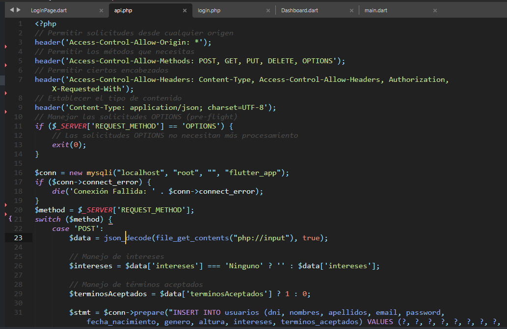

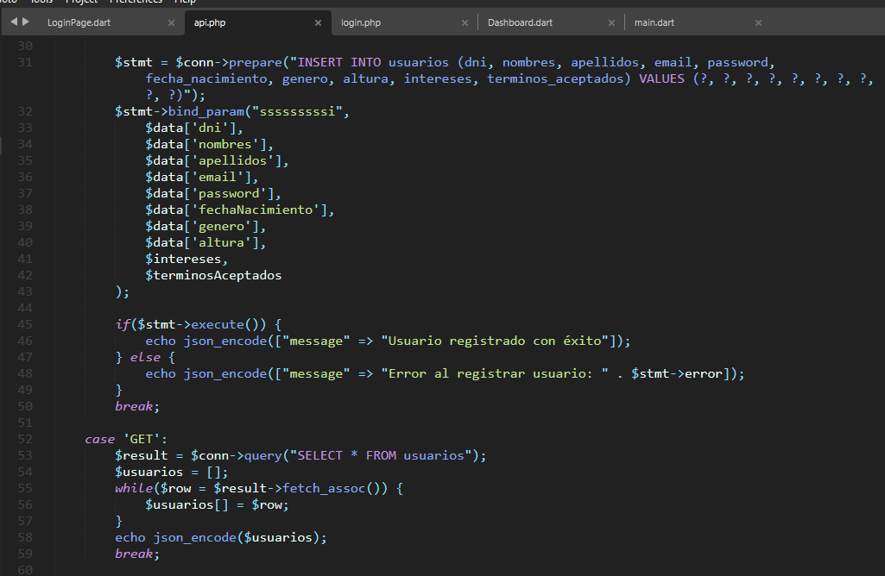

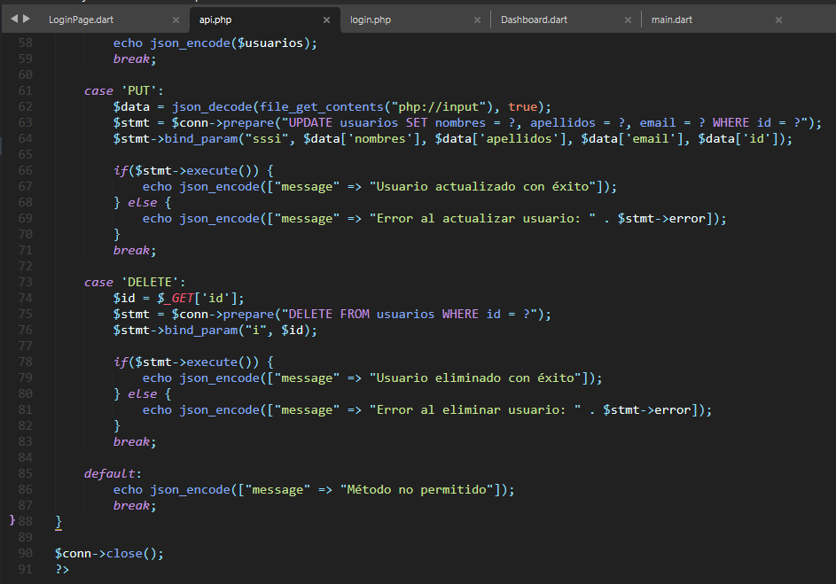

**2. En el archivo ListarUsuarios.dart; actualizar el código... que quede así**

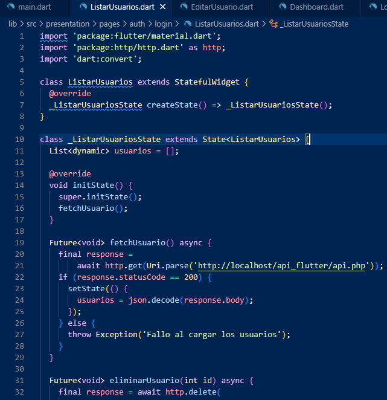

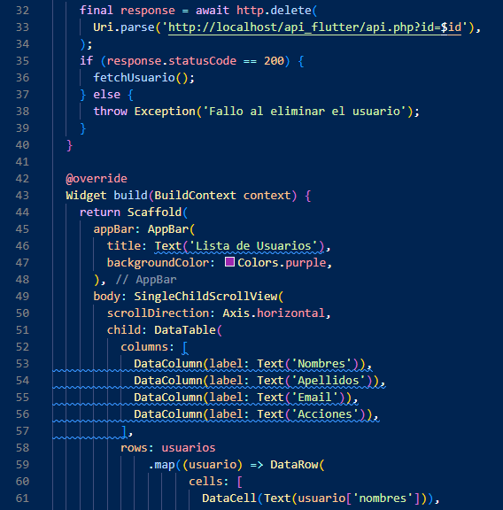

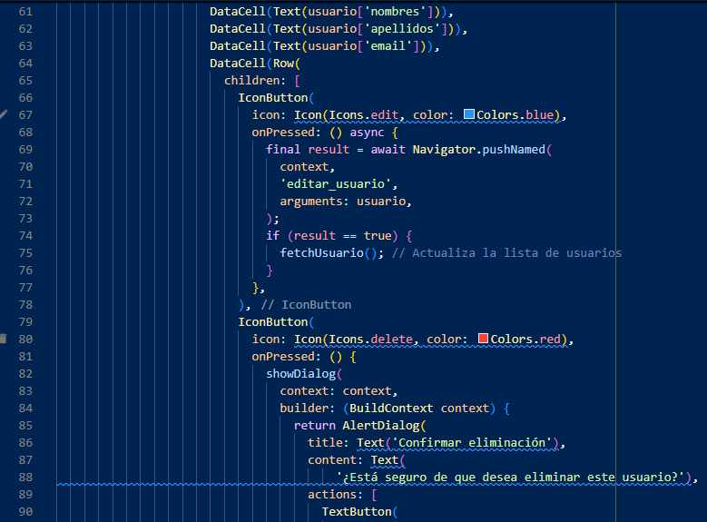

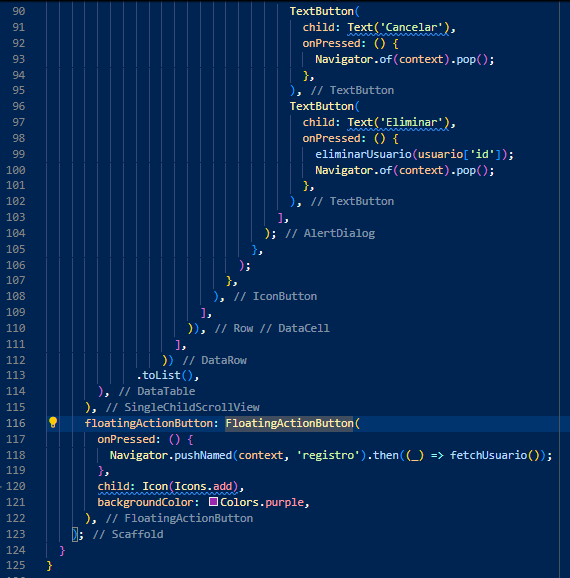

3. Crear el archivo **EditarUsuario.dart**

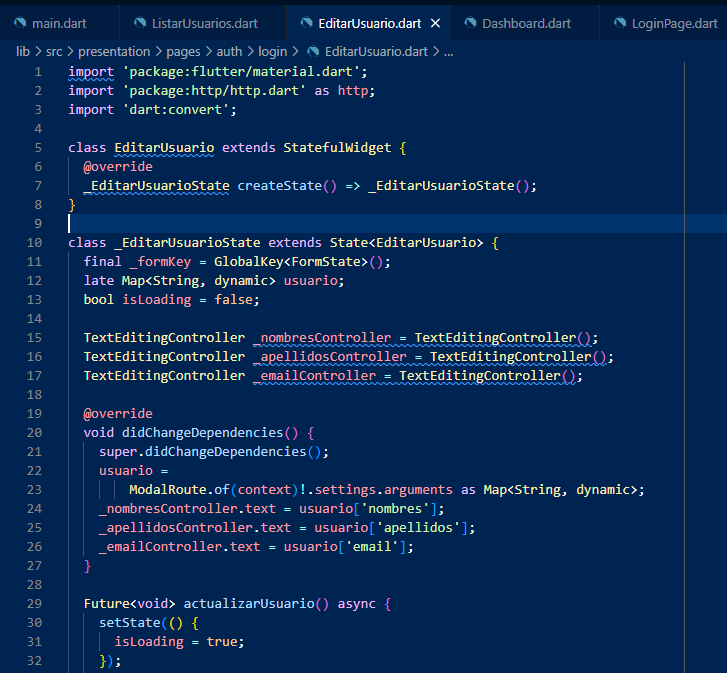

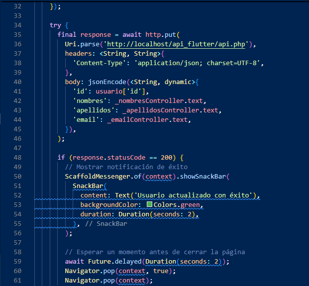

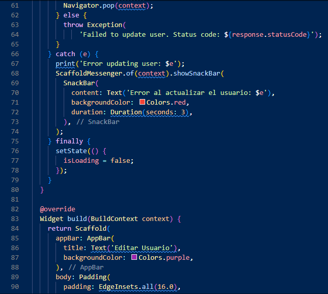

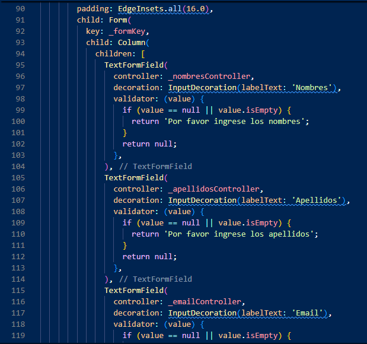

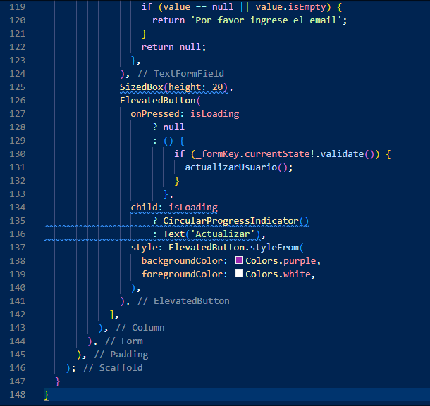

3. Actualizar el archivo **main.dart**

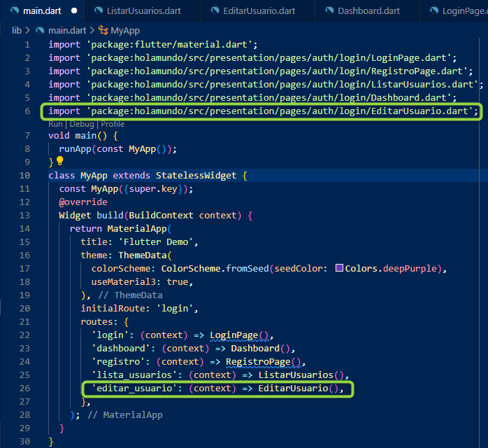

**Al ejecutar el archivo main.dart, deberá primero iniciar el loginPage.dart, ingresar DATOS REALES DE LA TABLA usuarios.... Al ingresar las credenciales correctas, el app les dará acceso al Dashboard.dart. POSTERIORMENTE podrán dar clic en Listar y verán la tabla con los registros a los cuáles podrán editar o eliminarlo: VER VÍDEO DE CLASE: https://drive.google.com/drive/folders/1Ad6ixdLwRXgP2fkBpAztMFJaw_oeoXKp?usp=sharing**
