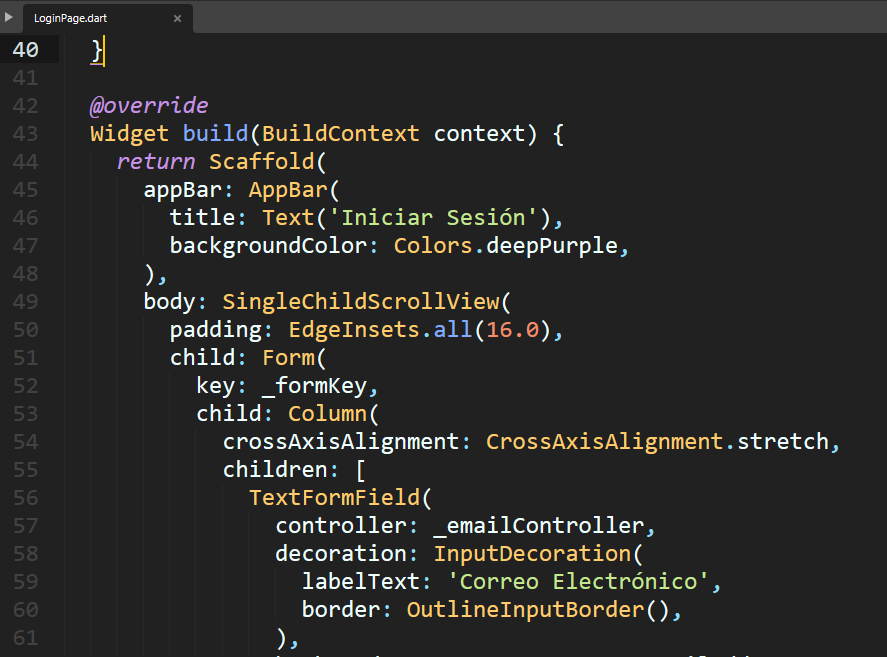

*CRUD COMPLETO DE TIENDA*

**1. Agregar el siguiente código "categoria.dart"**
Escribir el comando: 

Linea::
  class Categoria {
    final int? id;
    final String nombre;
    final String descripcion;
  
    Categoria({
      this.id,
      required this.nombre,
      required this.descripcion,
    });
  
    factory Categoria.fromJson(Map<String, dynamic> json) {
      return Categoria(
        id: int.parse(json['id'].toString()),
        nombre: json['nombre'],
        descripcion: json['descripcion'],
      );
    }
  
    Map<String, dynamic> toJson() {
      return {
        'id': id,
        'nombre': nombre,
        'descripcion': descripcion,
      };
    }
  }

**2. En el archivo LoginPage.dart; actualizar el código... que quede así**

.. image:: img/loginPage_1.png
   :height: 40
   :width: 90
   :scale: 10
   :alt: JoeAI

.. image:: img/loginPage_2.png
   :height: 40
   :width: 90
   :scale: 10
   :alt: JoeAI

.. image:: img/loginPage_4.png
   :height: 45
   :width: 90
   :scale: 10
   :alt: JoeAI

.. image:: img/loginPage_5.png
   :height: 45
   :width: 90
   :scale: 10
   :alt: JoeAI

3. Crear el archivo **Dashboard.dart**

Instalar desde el "command Prompt", el siguiente comando:

Linea::

  flutter pub add shared_preferences

3. Actualizar el archivo **main.dart**

.. image:: img/Main.dart_actualizado.png
   :height: 45
   :width: 90
   :scale: 10
   :alt: JoeAI

**Al ejecutar el archivo main.dart, deberá primero iniciar el loginPage.dart, ingresar DATOS REALES DE LA TABLA usuarios.... Al ingresar las credenciales correctas, el app les dará acceso al Dashboard.dart**
